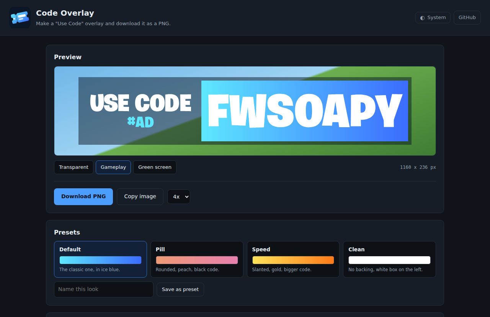
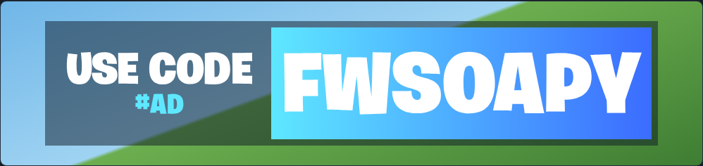
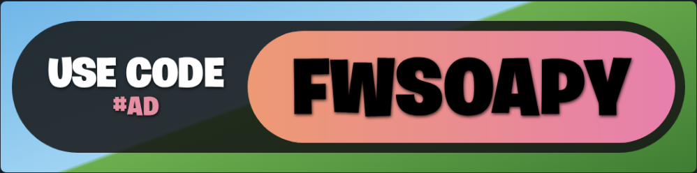
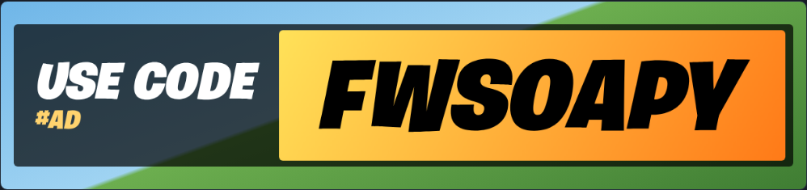
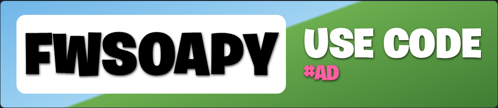

# 🎟️ Code Overlay

A free "Use Code" creator code overlay maker for Fortnite streamers. Type your code, pick a look, and download a transparent PNG you can drop straight into OBS. Everything runs in your browser, nothing to install.

**👉 [Open Code Overlay](https://fwsoapy.github.io/code-overlay/)**

---

## 📋 Table of contents

- [Quick start](#-quick-start)
- [Presets](#-presets)
- [Features](#-features)
- [Adding it to OBS](#-adding-it-to-obs)
- [Settings](#-settings)
- [FAQ](#-faq)
- [Running it yourself](#-running-it-yourself)
- [Credits](#-credits)

---

## 🚀 Quick start

1. Open the [site](https://fwsoapy.github.io/code-overlay/).
2. Click the code in the preview and type yours. Same for "USE CODE" and "#AD" if you want to change them.
3. Pick a preset, or change the colours yourself.
4. Hit **Download PNG**.

That's it. Add the PNG to OBS as an Image source and you're done.

---

## 🎨 Presets

Each preset changes more than colours: shape, spacing, slant and layout all shift too. Your code and text stay put when you switch.

<table>
<tr>
<td width="50%"><b>Default</b> The classic look, in ice blue. Square corners, 50% backing.  </td>
<td width="50%"><b>Pill</b> Fully rounded, peach to pink, black code with a shadow.  </td>
</tr>
<tr>
<td width="50%"><b>Speed</b> Slanted text, gold diagonal gradient, bigger code.  </td>
<td width="50%"><b>Clean</b> No backing, white box on the left. Made for busy gameplay.  </td>
</tr>
</table>

Made a look you like? Name it and hit **Save as preset**. It's kept in your browser for next time.

---

## ✨ Features

- **Click to edit**: click any text in the preview and type right on top of it
- **Real Fortnite font**: Burbank Big Black, with a toggle for Burbank Big Condensed Black
- **Gradient or solid** code box, black or white code text
- **Background opacity** so gameplay shows through (50% by default)
- **Rounding** for the code box and the background, square by default like the in-game style
- **Type exact numbers** next to every slider instead of dragging
- **Transparent PNG** at 1x, 2x, 4x or 8x, or copy it straight to your clipboard
- **Preview backgrounds**: transparent, gameplay, or green screen, so you can see how it'll look on stream
- **Light and dark mode**
- Remembers your last overlay when you come back

---

## 📺 Adding it to OBS

1. Download your PNG.
2. In OBS, click **+** under Sources and pick **Image**.
3. Browse to the PNG and click OK.
4. Drag it where you want it. Hold **Alt** while dragging an edge to crop.

> 💡 Export at **4x** (the default) so it stays sharp even if you scale it up in OBS.

---

## 🧰 Settings

| Section | What you can change |
|---|---|
| **Text** | Creator code, label ("USE CODE"), small text ("#AD"), show or hide #AD, condensed font, label and #AD colours |
| **Code box** | Gradient on/off, gradient colours or solid colour, black or white code text, rounding |
| **Background** | Colour, opacity, rounding |
| **More** | Label size, code size, slant, code box on the left, text shadow |

**Reset everything** at the bottom puts it all back to the Default preset.

---

## ❓ FAQ

**Is it free?**
Yes.

**Do I need to download or install anything?**
No. It's a website. The only thing you download is your PNG.

**Is anything I type sent anywhere?**
No. The whole thing runs in your browser. Your code and settings are only saved in your own browser.

**My saved presets disappeared.**
They live in your browser's storage, so clearing site data or using a private window will lose them.

**Can I use it for games other than Fortnite?**
Sure. Change "USE CODE" to whatever you want.

**Copy image doesn't work.**
Not every browser supports copying images. Use Download instead.

---

## 🔧 Running it yourself

The whole site is one file. Download `index.html` and open it in your browser, it works offline. The fonts are embedded in the page, so there's nothing else to grab.

To host your own copy, fork this repo and turn on GitHub Pages: **Settings > Pages > Deploy from a branch > `main` / root**.

---

## 💬 Credits

Built by **fwsoapy**. Also check out [SeedForge](https://github.com/fwsoapy/seedforge) and the [Fortnite Ranked Overlay](https://github.com/fwsoapy/ranked-overlay).

Burbank Big Black and Burbank Big Condensed Black are by House Industries, used with permission.
